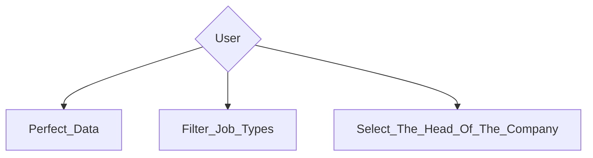
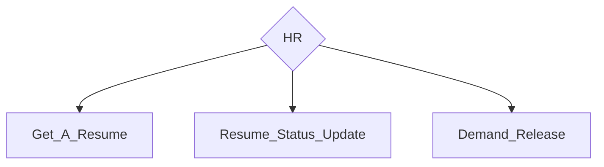
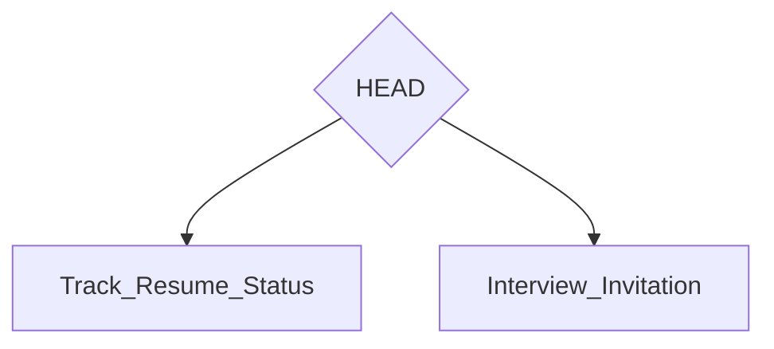
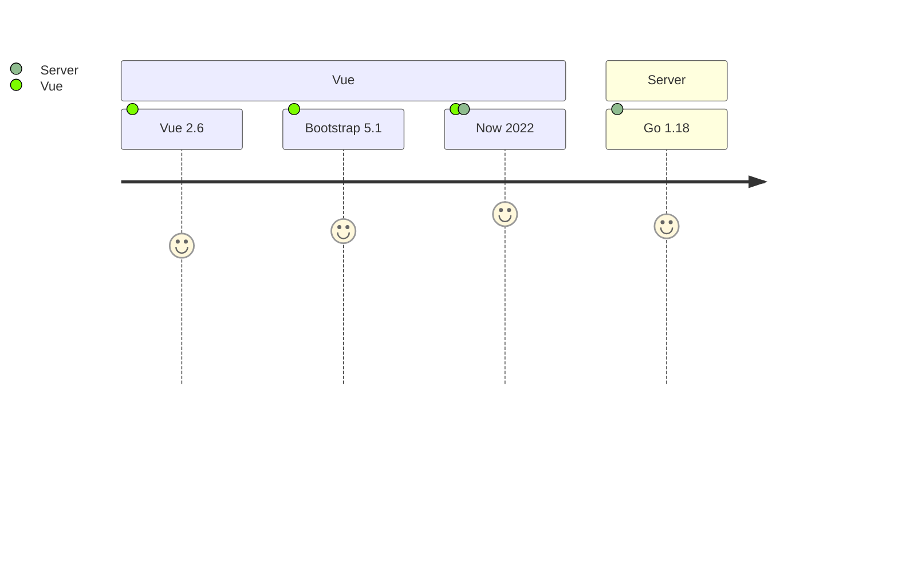

## Resume Tracking System

```ini
  _____     _____   _______
 |  __ \   / ____| |__   __|
 | |__) | | (___      | |
 |  _  /   \___ \     | |
 | | \ \   ____) |    | |
 |_|  \_\ |_____/     |_|

|> Simple And Efficient Resume Tracking System, Priority User Experience
```

> An applicant tracking system (ATS) is designed to improve the recruitment process by making hiring simpler and more efficient. Applicant Tracking Systems allow companies of all sizes to stay organized and productive throughout the hiring process by managing job postings, filtering resumes, organizing applicant information, contacting applicants, and scheduling interviews.

## Architecture









## We Need Help

### GO

- PDF file is not downloadable
- PDF file encryption
- Notice
- ...

### Vue

- label block
- Detect user printing frequency
- User incognito mode
- ...
